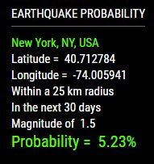

# MMM-Earthquake

The probability of an earthquake in your city. You'll be surprised!

## Example

Takes up very little of your precious screen real estate

## Earthquake Magnitude Scale

* 2.4 or less ---------- Usually not felt, but can be recorded by seismograph. ----- 900,000 per year
* 2.5 to 5.4 ----------- Often felt, but only causes minor damage. ----------------- 30,000 per year
* 5.5 to 6.0 ----------- Slight damage to buildings and other structures. ---------- 500 per year
* 6.1 to 6.9 ----------- May cause a lot of damage in very populated areas. ------- 100 per year
* 7.0 to 7.9 ----------- Major earthquake. Serious damage. ------------------------- 20 per year
* 8.0 or greater ------ Great earthquake. Can totally destroy communities. -------- 1 per 5-10 years

## Installation of module and dependencies

* `git clone https://github.com/mykle1/MMM-Earthquake.git` into `~/MagicMirror/modules` directory.
* `npm install` in your `~/MagicMirror/modules/MMM-Earthquake` directory.

## Add to Config.js

    {
        module: "MMM-Earthquake",
        position: "top_left",
        config: {
			place: "New York, NY", // New York, NY is default (Enter your city and state)
			radius: "50",          // 50km = 31.0686 miles (search radius)
			days: "365",           // 365 is default within how many days (1 - 365)
			mag: "2.5",            // Magnitude = 1.0 - 9.9 (9.5 highest ever recorded)
			maxWidth: "300px",
			header: "Earthquake Probability",  // Empty the quotes for no header
        }
    },

## Special thanks to

* Charles F. Richter - Developer of the Richter scale.
* United States Geological Survey
* OpenHazards.com - Earthquake Forecasting and Hazard Analysis
* Space Cowboy

